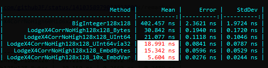

*LodgeX4CorrNoHigh* algorithm of the high-speed multiplications of **128-bit** numbers.

```
Copyright (c) 2021  Denis Kuzmin <x-3F@outlook.com> github/3F
```

[ [ ☕ Make a donation ](https://3F.github.io/Donation/) ]

[](https://twitter.com/github3F/status/1410358979033813000)

* Part of https://twitter.com/github3F/status/1403748080760111106

## .NET implementation

*LodgeX4CorrNoHigh* class provides several ways of setting and getting numbers by using uint, ulong, or bytes array. Just play with available [Unit-Tests](tests) and [Speed-Tests](https://github.com/3F/sandbox/tree/master/csharp/numbers/BigNum).

### Examples

For example, using ulong (UInt64)

```csharp
//   0x4BD4823ECC5D03EB19E07DB8FFD5DABE
// × 0x1D05906000069ABC40A30C07A70906D1

ulong high = LodgeX4CorrNoHigh.Multiply
(
    0x4BD4823ECC5D03EB, 0x19E07DB8FFD5DABE,
    0x1D05906000069ABC, 0x40A30C07A70906D1,
    out ulong low
);
//          high            low
//     ________________|_______________
// = 0xACBBE8EAB60C77E249B25D708366091E
```

### Embeddable superfast version

To reduce the amount of unnecessary stack manipulations (ldloca.s/ldarg.. etc), meet an *embeddable* version.

One 128x128 multiplication requires less than ~ **0.02 ns** == 0.00000000002 sec

```csharp
//   0xC1F4271980F30FED81EF70CCBC6EF2EF
// × 0xDEF03F0142D0ACD21749BEF1EA30FF94

uint a = 0xC1F42719, b = 0x80F30FED, c = 0x81EF70CC, d = 0xBC6EF2EF;
uint ma = 0xDEF03F01, mb = 0x42D0ACD2, mc = 0x1749BEF1, md = 0xEA30FF94;
//-
ulong high, low;
unchecked{/*(c) Denis Kuzmin <x-3F@outlook.com> github/3F */ulong A=(ulong)b*mb;ulong B=A&0xFFFF_FFFF;ulong C=((A>>32)+B+(a*ma))&0xFFFF_FFFF;ulong D=(a>b)?a-b:b-a;ulong E=(ma>mb)?ma-mb:mb-ma;if(D!=0&&E!=0){ulong F=D*E;if((!(a>b)&&(ma>mb))||((a>b)&&!(ma>mb))){C+=F&0xFFFF_FFFF;}else{C-=F&0xFFFF_FFFF;}}ulong G=(C<<32)+B;A=(ulong)c*mc;ulong H=(ulong)d*md;B=(H>>32)+(H&0xFFF_FFFF_FFFF_FFFF)+(A&0xFFF_FFFF_FFFF_FFFF)+((A&0xFFF_FFFF)<<32);C=((((A>>28)+(A>>60)+(H>>60))<<28)>>16)+(B>>48);ulong I=B&0xFFFF_FFFF_FFFF;D=(c>d)?c-d:d-c;E=(mc>md)?mc-md:md-mc;if(D!=0&&E!=0){ulong F=D*E;ulong J=(F>>48);ulong K=F&0xFFFF_FFFF_FFFF;B=I;if((!(c>d)&&(mc>md))||((c>d)&&!(mc>md))){I+=K;C+=J;if(B>(I&0xFFFF_FFFF_FFFF))++C;}else{I-=K;C-=J;if(B<(I&0xFFFF_FFFF_FFFF))--C;}}ulong L=((I&0xFFFF_FFFF)<<32)+(H&0xFFFF_FFFF);C=G+L+((C<<16)+((I>>32)&0xFFFF));G=((ulong)a<<32)+b;I=((ulong)c<<32)+d;A=((ulong)ma<<32)+mb;H=((ulong)mc<<32)+md;D=(G>I)?G-I:I-G;E=(A>H)?A-H:H-A;if(D!=0&&E!=0){ulong F=D*E;if((!(G>I)&&(A>H))||((G>I)&&!(A>H))){C+=F;}else{C-=F;}}low=L;high=C;}

//          high            low
//     ________________|_______________
// = 0x9633C106748CB7D96650F9EA76F0832C
```
(**1 ns** == 0.000000001 sec)