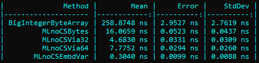

*MulLowNoCorrShifts* (MLnoCS) is the most trivial algorithm of the high-speed multiplications of 128 × 16 numbers.

This was designed for 128×16 due to UTF-16 (theoretically up to 128×32). Part of https://twitter.com/github3F/status/1403748080760111106

For high-speed multiplications of **128 × 128** numbers see **LodgeX4CorrNoHigh** algorithm.

```
Copyright (c) 2021  Denis Kuzmin <x-3F@outlook.com> github/3F
```

[ [ ☕ ](https://3F.github.io/Donation/) ]

Part of https://twitter.com/github3F/status/1403748080760111106

## MLnoCS vs LX4Cnh

Algorithm | Maximum bits | One multiplication
----------|--------------|-------------------
LX4Cnh    | 128 × 128    | less than ~ **4.3 ns** == 0.0000000043 sec
MLnoCS    | 128 × 16 (*<sup>1</sup>32) | less than ~ **0.31 ns** == 0.00000000031 sec
LX4Cnh optimized\*<sup>2</sup> | 128 × 128 | \*<sup>2</sup> less than ~ **0.86 ns** == 0.00000000086 sec

* \*<sup>1</sup> - theoretically up to 128 x 32 with some correction.
* \*<sup>2</sup> - The actual calculation using LX4Cnh can be a bit optimized such for FNV1a-128 implementation (find it in my repo).

(**1 ns** == 0.000000001 sec)

## .NET implementation

*MulLowNoCorrShifts16* class provides several ways of setting and getting numbers by using uint, ulong, or bytes array. Just play with available [Unit-Tests](tests) and [Speed-Tests](https://github.com/3F/sandbox/tree/master/csharp/numbers/BigNum).

[](https://twitter.com/github3F/status/1410358979033813000)

### Examples

For example, using ulong (UInt64)

```csharp
//   0x4BD4823ECC5D03EB19E07DB8FFD5DABE
// ×                             0x6D5C

ulong high = MulLowNoCorrShifts16.Multiply
(
    0x4BD4823ECC5D03EB, 0x19E07DB8FFD5DABE,
    0x6D5C,
    out ulong low
);
//          high            low
//     ________________|_______________
// = 0xBBD38B950C188281E234F369FEFD8248
```

### Embeddable superfast version

To reduce the amount of unnecessary stack manipulations (ldloca.s/ldarg.. etc), meet an *embeddable* version.

One 128×16 multiplication using *MLnoCS* requires less than ~ 0.31 ns == 0.00000000031 sec

```csharp
//   0xC1F4271980F30FED81EF70CCBC6EF2EF
// ×                             0x1036

uint a = 0xC1F42719, b = 0x80F30FED, c = 0x81EF70CC, d = 0xBC6EF2EF;
ushort prime = 0x1036;
//-
uint ra, rb, rc, rd;
unchecked{/* MLnoCS (c) Denis Kuzmin <x-3F@outlook.com> github/3F */ulong e=a,f=b,g=c,h=d,l,o,k;e*=prime;f*=prime;g*=prime;h*=prime;l=(g&0xFFFF_FFFF)+(h>>32);o=(f&0xFFFF_FFFF)+(g>>32);k=(e&0xFFFF_FFFF)+(f>>32);ra=(uint)k;rb=(uint)o;rc=(uint)l;rd=(uint)h;}
//     high A | high B | low C | low D
//     ______HIGH______|______LOW______
// = 0x2BF1D770644434385F8E96F6AE962E6A
```
(**1 ns** == 0.000000001 sec)

See also *LodgeX4CorrNoHigh* for 128 × 128,

* https://twitter.com/github3F/status/1410669589734768643
* https://twitter.com/github3F/status/1410358979033813000