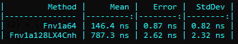
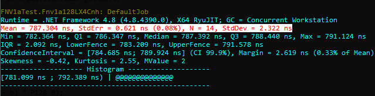

*FNV-1a* high-speed implementations

```
Copyright (c) 2021  Denis Kuzmin <x-3F@outlook.com> github/3F
```

[ [ ☕ ](https://3F.github.io/Donation/) ]

Part of https://twitter.com/github3F/status/1403748080760111106

## speed

### FNV-1a-128 using LX4Cnh

120 Unicode (UTF-16) characters as follow:

`*LodgeX4CorrNoHigh* (LX4Cnh) algorithm of the high-speed multiplications of **128-bit** numbers (full range, 128 × 128).`

[](#)

> 128-bit hash value: 0x8e719ac9080952dec9c90a46279bfcc9

[](#)
