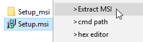

## msiextr

**MSI** extractor (Shell extension). For quick unpacking files from Windows Installer Package, and for other access ... 

*Specially for [ghdir](https://github.com/3F/sandbox/tree/master/shell/ghdir)*

From my old gist:

* https://gist.github.com/3F/c14f9e0c1cc89986ac5de8b4481411b8



# Why msiextr ?

When you need something **without installation,** for example, svn client from this case: https://github.com/3F/sandbox/tree/master/shell/ghdir


Let's see the following example: 

Latest 7-zip (18.5) will unpack the [TortoiseSVN-1.10.1.28295-x64-svn-1.10.2.msi](https://osdn.net/projects/tortoisesvn/storage/1.10.1/Application/TortoiseSVN-1.10.1.28295-x64-svn-1.10.2.msi) simply 'as is' *(I will not tell about PE and how does it work):*

```text
└───TortoiseSVN-1.10.1.28295-x64-svn-1.10.2
        F_TortoiseSVN_en
        F__aprlicense
        F__BlipAddedIcon
        F__BlipCleanAddedIcon
...
        F__CLIsvnbench
        F__CLIsvndumpfilter
        F__CLIsvnlook
        F__CLIsvnmucc
        F__CLIsvnrdump
        F__CLIsvnserve
        F__CLIsvnsync
        F__CLIsvnversion
        F__concrt140
```

While **msiextr** just provides what you need:

```text
...
│
├───bin
│     ...
│       svn.exe
│       svnadmin.exe
│       svnbench.exe
│       svndumpfilter.exe
│       svnlook.exe
│       svnmucc.exe
│       svnrdump.exe
│       svnserve.exe
│       svnsync.exe
│       svnversion.exe
│     ...
│       ucrtbase.dll
│       vcamp140.dll
│       vccorlib140.dll
│       vcomp140.dll
│       vcruntime140.dll
│     ...
│
├───Common
│   └───TortoiseOverlays
│       │   License.txt
│       │   TortoiseOverlays.dll
│       │
│       └───icons
│         ....
│
├───Diff-Scripts
...
```

Now you can use [ghdir](https://github.com/3F/sandbox/tree/master/shell/ghdir) more efficiently. Or something other.


hmmm, ...

[ [☕](https://3F.github.io/Donation/) ]

::